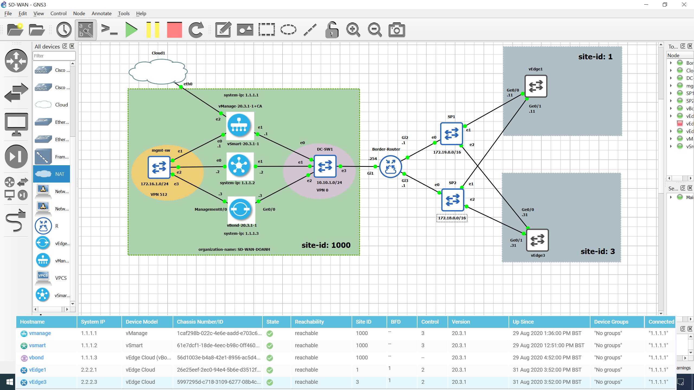
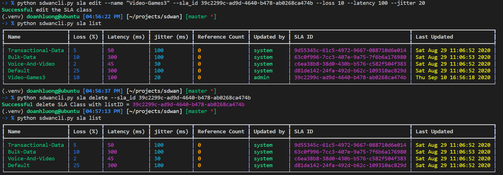

# sdwan-python-rest-api

## SD-WAN 20.3.1

This public repo contains python code that can be used to interact with the Cisco SD-WAN vManage REST API. The environment is pre-configured to access my local SD-WAN lab in GNS3. 

You can edit the variables in the `vmanage/constants.py` to point to your own vManage instance, the AlwaysOn SDWAN Sandbox, or the Reservable
SDWAN Sandbox.

**Note:** When you use the AlwaysOn Sandbox, you do not have permission to perform
some commands such as `edit`, `create`, `delete`.


### Topology



## Current functions
The code contains REST API calls to authenticate and interact with Cisco SD-WAN vManage 20.3.1. Currently, it supports the following functions:
```bash
-> % python sdwancli.py 
Usage: sdwancli.py [OPTIONS] COMMAND [ARGS]...

  Command line tool for deploying templates to CISCO SDWAN.

Options:
  --help  Show this message and exit.

Commands:
  bfd       Commands to monitor bfd sessions: link --state, summary, session
  device    Commands to see details of device: list
  omp       Commands to monitor omp: tlocs, tloc-paths
  sla       Commands for managing SLA Class: list, create, edit, delete
  template  Commands to manage template: delete, list, show
```

And for each command, it supports some subcommands, for example, `template` command:

```bash
-> % python sdwancli.py template
Usage: sdwancli.py template [OPTIONS] COMMAND [ARGS]...

  Commands to manage template: create, delete, list, show

Options:
  --help  Show this message and exit.

Commands:
  delete  Delete a feature template
  list    Get template list
  show    Show details of a feature template
```

Another `bfd` command has following subcommands:

```bash
-> % python sdwancli.py bfd                            
Usage: sdwancli.py bfd [OPTIONS] COMMAND [ARGS]...

  Commands monitor bfd sessions: link --state, summary

Options:
  --help  Show this message and exit.

Commands:
  link     Get list of bfd links with status: up or down
  session  Show BFD sessions at a device
  summary  Show BFD summary of a device
```

You can access the help of each subcommand to know about the arguments using 
`python sdwancli.py {command} {subcommand} --help`, for example:

```bash
-> % python sdwancli.py sla create --help
Usage: sdwancli.py sla create [OPTIONS]

  Create a SLA Class

Options:
  --name TEXT         name of the SLA Class
  --description TEXT  description of the SLA Class
  --loss TEXT         loss 0 - 100 %
  --latency TEXT      latency 1 - 1000 ms
  --jitter TEXT       jitter 1 - 1000 ms
  --help              Show this message and exit.
```

## Requirements

To use this code you will need:

- Python 3.8+
- vManage user login details. (User should have privilege level to configure policies)

## Install and Setup
Clone the code to local machine.
```bash
git clone https://github.com/kimdoanh89/sdwan-python-rest-api
cd sdwan-python-rest-api
```

Setup Python Virtual Environment (requires Python 3.8+)
```bash
python3.8 -m venv venv
source venv/bin/activate
pip3 install -r requirements.txt
```
A .py file with the Cisco SD-WAN credentials has been created in `vmanage/constants.py`. You can edit the variables in the file to point to your own vManage instance.

## Outputs
### Device list

```bash
python sdwancli.py device list
```


### Template list, show, delete

```bash
python sdwancli.py template list
python sdwancli.py template show --template_id cb81c4d1-110b-4f33-9925-bf4889129019
python sdwancli.py template delete --template_id cb81c4d1-110b-4f33-9925-bf4889129019
```


### BFD sessions monitor

```bash
python sdwancli.py bfd link --state up
python sdwancli.py bfd link --state down
```


```bash
python sdwancli.py bfd session --system_ip 2.2.2.1
```


```bash
python sdwancli.py bfd summary --system_ip 2.2.2.1
```


### SLA Class manager
#### SLA list and create

```bash
python sdwancli.py sla list
python sdwancli.py sla create --name "Video-Games3" --description "videogame 3" --loss 1 --latency 20 --jitter 5
```


#### SLA edit and delete
```bash
python sdwancli.py sla edit --name "Video-Games3" --sla_id 9e5efdbe-ef79-4797-b3d3-d9b732d45422 --loss 10 --latency 100 --jitter 20
python sdwancli.py sla delete --sla_id 9e5efdbe-ef79-4797-b3d3-d9b732d45422
```



### OMP monitor
#### omp tlocs
```bash
python sdwancli.py omp tlocs --system_ip 2.2.2.1
```


#### omp tloc-paths
```bash
python sdwancli.py omp tloc-paths --system_ip 2.2.2.1
```
```bash
tloc-paths entries 2.2.2.1 default ipsec
tloc-paths entries 2.2.2.2 default ipsec
tloc-paths entries 2.2.2.3 default ipsec
```
